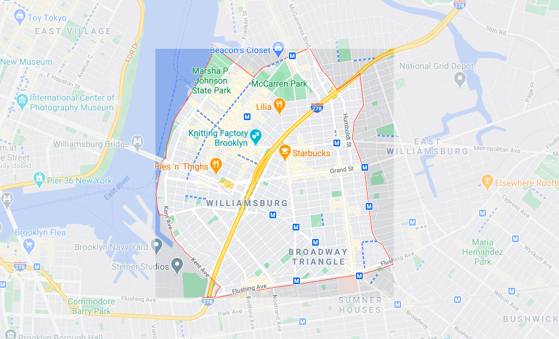

### Williamsburg

The neighborhood that I worked on for CSCI 127 is **Williamsburg** in Brooklyn, NY. 


## HC6



This image is a map of Brooklyn with Williamsburg highlighted.  

## HC2
   Williamsburg is neighborhood in Brooklyn with the zip codes 11211 and 11206. The population of this neighborhood is 75% white. The majority of people living in Williamsburg are 18 to 35 years old (36%) and the second highest demographic is 35 to 64 years old (31%). Most housing units are rented and only 16% is owned. The median house value is 1 million dollars.

## HC3
   For HC3, my partner and I analyzed the rankings from multiple websites for our neighborhoods. Williamsburg is one of the best places to live in New York City, according to Niche and other rankings. The neighborhood is good for young professionals and families due to its above average public education and the dense urban feel. Although it is not considered the safest, it has many restaurants, shops, and parks for the community. Williamsburg was rated A+ for its nightlife and is very close to the city, making it a hotspot for travelers.

## HC7+8

## HC9
<dl>
<iframe src="AirbnbWilliamsburg.html" width="600" height="400" frameborder="0" frameborder="0" marginwidth="0" marginheight="0" allowfullscreen></iframe>
</dl>

```markdown
Syntax highlighted code block

# Header 1
## Header 2
### Header 3

- Bulleted
- List

1. Numbered
2. List

**Bold** and _Italic_ and `Code` text

[Link](url) and 
```

For more details see [GitHub Flavored Markdown](https://guides.github.com/features/mastering-markdown/).

### Jekyll Themes

Your Pages site will use the layout and styles from the Jekyll theme you have selected in your [repository settings](https://github.com/jmzion/HC8/settings). The name of this theme is saved in the Jekyll `_config.yml` configuration file.

### Support or Contact

Having trouble with Pages? Check out our [documentation](https://docs.github.com/categories/github-pages-basics/) or [contact support](https://github.com/contact) and we’ll help you sort it out.
