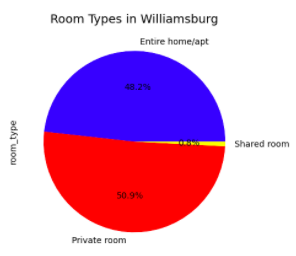
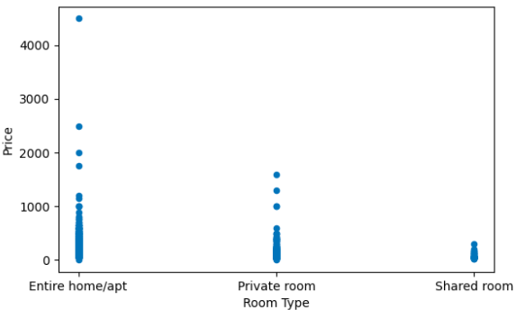
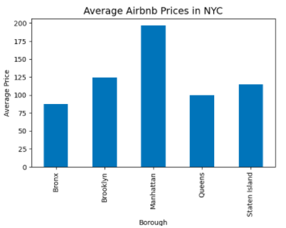

# Williamsburg

The neighborhood that I worked on for CSCI 127 is **Williamsburg** in Brooklyn, NY. 

### HC6
###### Figure 1.

Figure 1 is a map of Brooklyn with Williamsburg highlighted.  

### HC2
'''Williamsburg is neighborhood in Brooklyn with the zip codes 11211 and 11206. The population of this neighborhood is 75% white. The majority of people living in Williamsburg are 18 to 35 years old (36%) and the second highest demographic is 35 to 64 years old (31%). Most housing units are rented and only 16% is owned. The median house value is 1 million dollars.

### HC3
'''For HC3, my partner and I analyzed the rankings from multiple websites for our neighborhoods. Williamsburg is one of the best places to live in New York City, according to Niche and other rankings. The neighborhood is good for young professionals and families due to its above average public education and the dense urban feel. Although it is not considered the safest, it has many restaurants, shops, and parks for the community. Williamsburg was rated A+ for its nightlife and is very close to the city, making it a hotspot for travelers.

### HC7+8
'''Using pyhton, I was able to analyze the data of all the Airbnbs in NYC and create plots about it. There is a total of 20,104 Airbnbs listings in Brooklyn. There is a total of 3,920 Airbnb listings in Williamsburg. 19.5% of total listings in Brooklyn are listings in Williamsburg. The average price of listings in Williamsburg is $143.80. The average minimum number of nights is 6 nights. The average number of reviews is 21.79 reviews and the maximum is 404 reviews.
###### Figure 2.

Figure 2 shows the percentage of listings that are private rooms, whole apartments, and shared rooms.
###### Figure 3.

Figure 3 shows that entire homes and apartments tend to be more expensive than private rooms and shared rooms.
###### Figure 4.

Figure 4 shows the average price of listings in all of the boroughs. Brooklyn is the second most expensive.  
All of these data shows that Brooklyn is an expensive place to book an Airbnb yet is popular, especially Williamsburg. Most guests stay for around 6 nights at the listings and the guest leave many reviews. While some listings are not as popular as others, many recieve many guests and reviews monthly.

### HC9
<dl>
<iframe src="AirbnbWilliamsburg.html" width="600" height="400" frameborder="0" frameborder="0" marginwidth="0" marginheight="0" allowfullscreen></iframe>
</dl>

